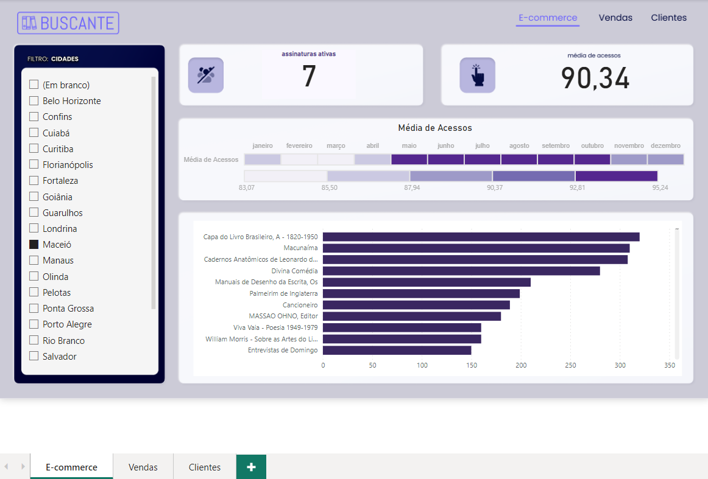
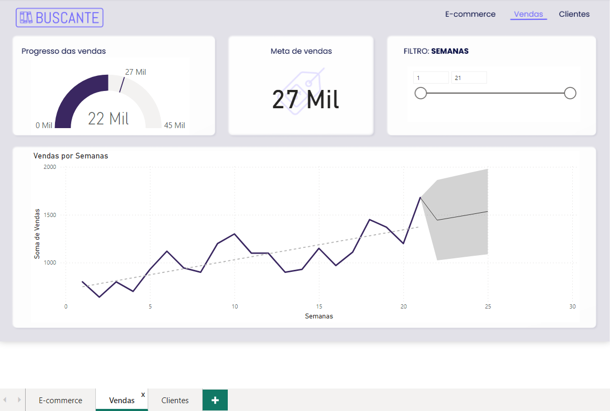
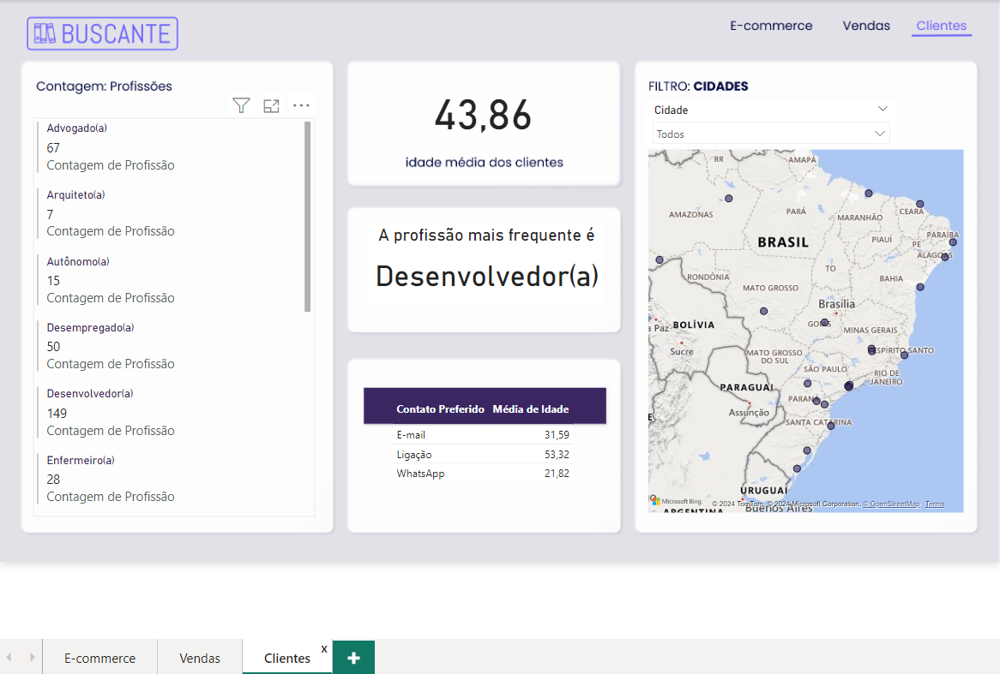

## Projeto feito por Leandro Launé

## Project Made by Leandro Launé

# Descrição do Projeto

# Project Description

### Portuguese Version:

Neste projeto de Power BI, realizou-se uma análise do e-commerce de livros Buscante. Desenvolveu-se um projeto completo no Power BI Desktop, com cartões, gráficos de barras e colunas, além de segmentos de dados para filtros interativos. Utilizaram-se recursos visuais não nativos e gráficos de indicadores e linha. As análises de vendas e clientes foram consolidadas em um Dashboard navegável. Implementaram-se gráficos de mapas, abordando erros comuns e soluções. O resultado foi um Dashboard interativo e informativo.

### English Version:

In this Power BI project, an analysis of the Buscante book e-commerce was carried out. A complete project was developed in Power BI Desktop, with cards, bar and column charts, as well as data segments for interactive filters. Non-native visual resources and indicator and line graphs were used. Sales and customer analyzes were consolidated into a navigable Dashboard. Map graphics were implemented, addressing common errors and solutions. The result was an interactive and informative Dashboard.

# Dashboard de Visualização de Dados analisados

# Analyzed Data Visualization Dashboard

## E-commmerce

### Portuguese Version:

Na primeira Página do dashboard construiu-se:

1. Filtro por cidades para a possibilidade da exibição de assinaturas ativas especificamente relacionadas à cidade selecionada.
2. Cartão de assinaturas ativas e média de acesso.
3. Tabela de calor de média de acesso.
4. Gráfico de barras de valor do livro por título.

### English Version:

On the first page of the dashboard, the following was created:

1. Filter by city to display active subscriptions specifically related to the selected city.
2. Card of active subscriptions and average access.
3. Access average heat table.
4. Bar chart of book value by title.

## Acompanhamento de Vendas

### Portuguese Version:

Na segunda página do dashboard foi construído:

1. Indicador de progresso de vendas, sinalizando o total de vendas até o momento e a meta desejada.
2. Cartão de meta de vendas.
3. Filtro de Semanas para a exibição de dados específicos acerca de cada semana nos demais componentes da página.
4. Gráfico de linhas de acompanhamento de vendas.

### English Version:

On the second page of the dashboard, the following was created:

1. Sales progress indicator, signaling total sales to date and the desired goal.
2. Sales target card.
3. Weeks Filter for displaying specific data about each week in the other components of the page.
4. Sales tracking line chart.

## Perfil do Cliente

### Portuguese Version:

Na terceira página do dashboard implementou-se:

1. Tabela de contagem de profissões.
2. Cartão de idade média dos clientes.
3. Cartão de profissão mais frequente.
4. Mapa e filtro de cidade.
5. Tabela de forma de contato preferido de acordo com as respectivas idades médias dos clientes.

### English Version:

On the third page of the dashboard, the following was implemented:

1. Profession counting table.
2. Average age card of customers.
3. Most frequent profession card.
4. Map and city filter.
5. Table of preferred contact methods according to the respective average ages of customers.

## Observação

## Comment

### Portuguese Version:

A navegabilidade do dashboard é completameente funcional, uma vez que é possível navegar entre as páginas clicando nos botões adcionados ao canto superior direito.

### English Version:

The dashboard's navigability is completely functional, as it is possible to navigate between pages by clicking on the buttons added to the top right corner.
